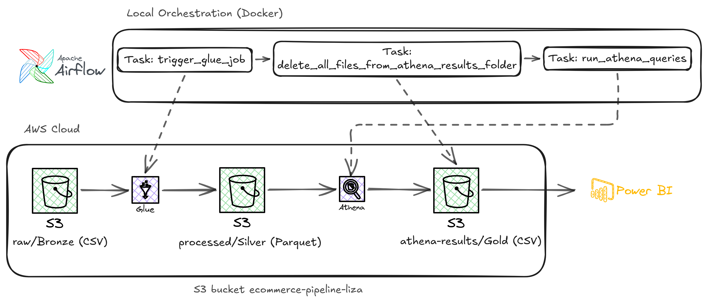

## Project Summary

Data project for processing and analyzing Olist ecommerce dataset (https://www.kaggle.com/datasets/olistbr/brazilian-ecommerce?select=olist_customers_dataset.csv). 

This project processes and analyzes the Olist e-commerce dataset through an automated AWS data pipeline. Apache Airflow orchestrates the workflow, using AWS Glue (PySpark) for data cleaning, Boto3 for S3 storage management, and Amazon Athena for SQL transformations. 

The final data is visualized in a Power BI dashboard to deliver business insights.

## Pipeline Architecture

Apache Airflow orchestrates a Medallion data lake architecture on AWS. Raw CSVs (Bronze) are transformed via AWS Glue PySpark into optimized Parquet files (Silver), which are then queried by Amazon Athena to create final business-level aggregations (Gold) for Power BI.

## Dashboard

Built in Power BI Desktop connecting to AWS Athena query results stored in Amazon S3. 
The published dashboard uses a static, imported dataset. 

### Revenue Overview

### Payment Breakdown

### Customer Analysis

### Delivery Analysis

### Category Analysis

[Download .pbix file](dashboard/olist_dashboard.pbix)
