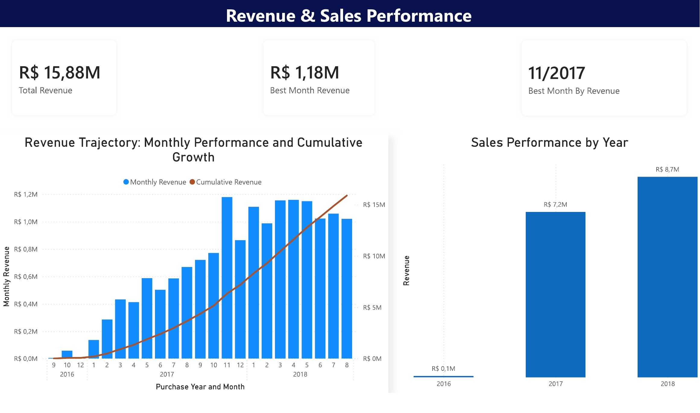
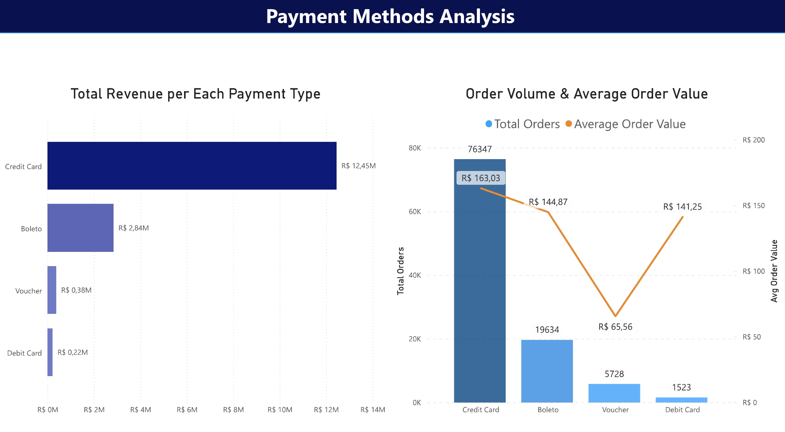
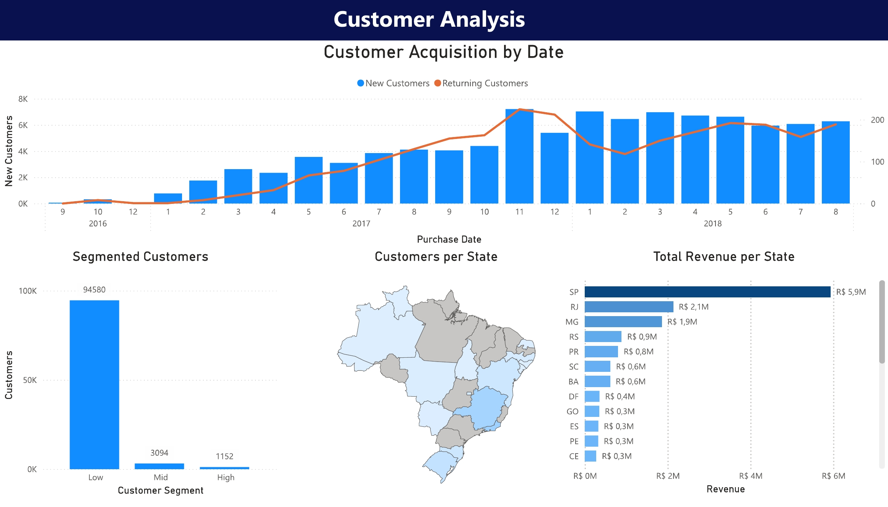
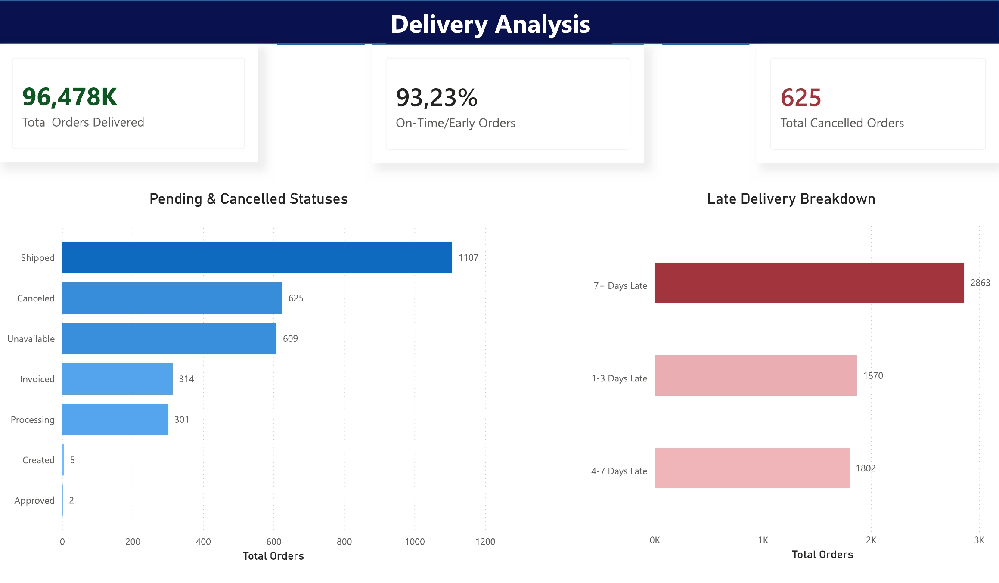
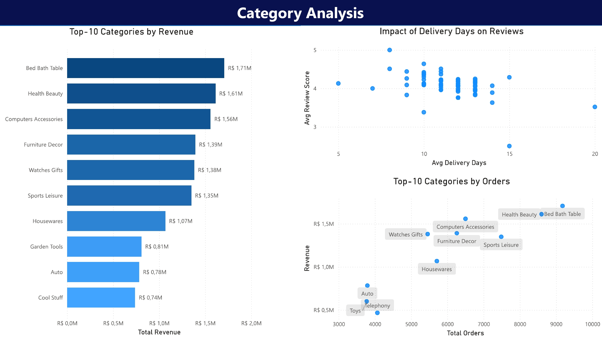

## Dashboard

Built in Power BI Desktop connecting to Athena query results stored in S3.

### Revenue Overview

### Payment Breakdown

### Customer Analysis

### Delivery Analysis

### Category Analysis

[Download .pbix file](dashboard/olist_dashboard.pbix)
